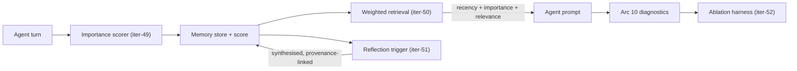

# HANDOFF_SENNA_ARC11 — Memory Architecture

**Owner:** GM-F → Senna-Ops → Cursor Architect → Cursor Builder
**Date:** 2026-08-20
**Arc:** 11 — Memory Architecture
**Iterations:** `senna-iter-49` through `senna-iter-53`
**Plan of record:** [`HANDOFF_SENNA_ARCS_9_TO_12.md`](./HANDOFF_SENNA_ARCS_9_TO_12.md)
**Goal:** Close Senna's memory gaps — importance, relevance, reflection — each independently switchable and each measured against a *real* Arc 10 baseline.

---

## State Entering Arc 11

Arc 9 (study instruments) and Arc 10 (memory diagnostics) are closed. Arc 10 closed
**PASS_WITH_ISSUES** on GM-F re-review, 2026-08-20. Suite at `340 passed, 2 skipped`.

The platform now has: Likert self-report supplementing float state (iter-40); the elicitation
runner (iter-41); blind plausibility packets (iter-42); proposition-agnostic calibration
machinery (iter-43); Apache 2.0 licensing (iter-44); memory-context instrumentation (iter-45);
a MemBench adapter (iter-46); the architectural interview (iter-47); and a canonical baseline
harness (iter-48).

It still has, unchanged since Arc 1: **recency-only memory.** `working_memory_last_k` defaults
to 2 and `peer_context_max_chars` to 1200. Nothing survives on merit. A pivotal event in round 2
is gone by round 6 while trivial chatter from round 5 is retained. That is the gap this arc closes.

---

## Carry-Forward From the Arc 10 Review — Opening Work

Four items. **Items 1 and 2 are blocking** — nothing in `senna-iter-49` onward starts until
they are done. Items 3 and 4 are folded into the arc's normal scope.

### 1. 🚧 BLOCKING — Regenerate the baseline from a real run

`docs/diagnostics/ARC10_BASELINE.md` is currently derived from a canonical *fixture* run. Its
numbers are degenerate as measurement:

- `included_clean: 2`, every other exclusion counter at zero — a two-item sample.
- MemBench at `1/1` in all four cells — four questions in total.
- **`group_addressed_proportion: 1.0`** — every turn was addressed to the group, and
  group-addressed turns bypass links entirely. The influence network filtered nothing.

As a reproducibility artefact this is fine and B6 verified it. As the pre-Arc-11 baseline it
cannot support any conclusion, and the arc's prioritisation decision currently rests on it.

**Do:** run the three diagnostics against a real simulation — non-study scenario, tier-1
agents, enough rounds that the exclusion counters actually move. Regenerate the baseline from
that. **Separate the two artefacts explicitly**: one document is the reproducibility fixture,
another is the measured baseline. They are currently the same file and doing different jobs.

**Also resolve, and report as a finding either way:** is `group_addressed_proportion: 1.0` an
artefact of the fixture, or a real property of how Senna types turns? If turns are
overwhelmingly group-addressed in real runs, the influence network is largely inert — and we
described that mechanism at length to the SSTRF committee. We need the answer on record.

### 2. 🚧 BLOCKING — Reconcile the contradictory hypothesis verdicts

Two documents on `main` record different verdicts for the same hypothesis:

| Source | Verdict | Numbers |
|---|---|---|
| `senna-iter-48-closeout.md` | **mixed** | recall 0.5 vs synthesis 0.375, delta 0.125 |
| `docs/diagnostics/ARC10_BASELINE.md` | **supported** | recall 1.0 vs synthesis 0.625, delta 0.375 |

Presumably the baseline was regenerated when B3 realigned the MemBench fixtures and the
closeout was never updated. Reconcile both against the item-1 real-run baseline and correct
whichever is wrong. **Do not simply delete the losing number** — record that it changed and why.

### 3. B2 residual — scale/row-volume regression

The bounded extra DB read before LLM execution (now capped at 24 rows) still has no test
proving it stays cheap as run size grows. Deferred from Arc 10 on the reasoning that Arc 11
rewrites this path, so the test should be written once, against the final code. Write it in
`senna-iter-50`, when retrieval is reworked.

### 4. Broken closeout links — do immediately

`senna-iter-45`, `46` and `47` closeouts point to
`docs/handoffs/HANDOFF_SENNA_ARC10_MEMORY_DIAGNOSTICS.md`, which does not exist on `main`.
Repoint to `handoff-to-architect.md` / `handoff-to-builder.md`. Five-minute fix; do not
ceremonially fold a link repair into an iteration.

---

## Non-Negotiables

- **Every mechanism ships behind a config flag, default off.** The legacy recency-only path
  must remain fully functional and tested throughout the arc. It is the ablation baseline.
- **Judge builds on platform measures** — MemBench, architectural interview, memory-context
  instrumentation. **Never on correspondence with a study case.** Using CIEPSS proposition
  match to choose architecture is fitting to the test set.
- **Nothing in this arc is a study run.** Substantive outputs are not cited as validity evidence.
- Preserve all Arc 7–10 request shapes and export contracts. Bump `EXPORT_VERSION` only if a
  field is added, and say so in the closeout.
- Cost is a first-class result. Every mechanism reports its token and wall-clock delta.
- Each iteration independently shippable.

---

## Target Architecture

---

## `senna-iter-49` — Importance Scoring

### Goal

Give memories a merit score so pivotal events can survive beyond the recency window.

### Scope

- At memory-write time, score each memory **1–10** for importance via the model. Prompt fixed,
  version-controlled, and recorded in the run config so it is auditable and ablatable.
- Persist the score with the memory; export it.
- Config: `importance_scoring_enabled` (default **false**), `importance_prompt_version`.
- **Batching:** implement per-round batched scoring as well as per-write. One extra call per
  turn at 300–400 turns is material. Report both costs; make the mode configurable.
- Record extraction provenance in the existing style — `model_parsed` / `repaired` / `fallback`
  — and report counts. A run where scoring degraded must be identifiable.

### Definition of Done

- Flag off ⇒ byte-identical behaviour to `main` on a fixed seed.
- Flag on ⇒ every memory carries a score; provenance counted; scores in the export.
- Cost delta measured and reported for both batching modes.
- Tests: valid parse; malformed→repair; fallback; batched vs per-write equivalence on a fixed
  seed; flag-off regression.

### Out of Scope

Using the score for retrieval — that is `senna-iter-50`. Reflection triggering — `iter-51`.

### Note for the closeout

No published work isolates Park's importance prompt for evaluation. We are not adopting
received best practice; we are running a pre-registered ablation of an unevaluated mechanism.
State it that way — it is a stronger position and it is true.

---

## `senna-iter-50` — Relevance-Conditioned Retrieval

### Goal

Replace the pure recency window with a weighted combination of recency, importance and relevance.

### Scope

- Embed memories via the existing ChromaDB integration.
- Retrieval score = `w_recency · recency + w_importance · importance + w_relevance · relevance`,
  each normalised to [0,1]. **Weights configurable and exported** — they are experimental
  parameters, not constants.
- Relevance is conditioned on the current situation (the agent's pending turn), not computed
  globally.
- Config: `weighted_retrieval_enabled` (default **false**), plus the three weights.
- Legacy recency-only path retained and tested.
- **Include the B2 scale/row-volume regression here** (carry-forward item 3), written against
  the reworked path.

### Definition of Done

- Flag off ⇒ identical retrieval to `main`.
- Flag on ⇒ retrieval order demonstrably responds to each of the three signals independently
  (a test that varies one weight at a time and asserts order changes).
- Memory-context instrumentation (iter-45) records *why* each item was retrieved, not only why
  items were excluded.
- Scale test proves the extra read stays bounded as run size grows.

### Out of Scope

Reflection. Changing `working_memory_last_k` or `peer_context_max_chars` defaults — those are
Arc 12 calibration decisions.

---

## `senna-iter-51` — Reflection

### Goal

Let agents derive higher-level statements from accumulated observations, rather than only
reporting what their persona card already told them.

### Scope

- **Trigger on accumulated importance, threshold configurable.** Park's 150 has never been
  evaluated and must not be inherited as fact. Default it, expose it, and treat it as a
  tunable factor.
- Reflections are synthesised into short statements, stored as memories, and retrievable
  alongside observations.
- **Provenance is required:** every reflection records which observations produced it. This is
  the cheap version of the Graphiti episode-to-semantic pattern and captures most of its
  auditability value at a fraction of the cost.
- Config: `reflection_enabled` (default **false**), `reflection_trigger_threshold`,
  `reflection_prompt_version`.

### Definition of Done

- Flag off ⇒ no reflections generated, no behaviour change.
- Flag on ⇒ reflections generated, stored, retrievable, and each traceable to its source
  observations.
- Provenance is queryable and exported.
- Architectural interview (iter-47) `reflection` category score improves against the item-1
  real baseline — or, if it does not, that is reported as the finding.

### Out of Scope

Recursive reflection over reflections (Park's reflection *trees*). Single-level only this arc.
Cross-run persona seasoning — that is the Lithtrix "memories" question and a later project.

### Why this iteration matters most

The Phase V hypothesis is that agents can report what they were told about themselves but
cannot derive what they learned. P3 — a self-concept claim written into the persona — scored 2
on nine of ten trials; P1 and P4, which require synthesising across rounds, scored 1 or 0.
Reflection is the mechanism that would close that gap. The item-1 baseline determines whether
the hypothesis survives contact with real data.

---

## `senna-iter-52` — Ablation Harness

### Goal

Measure what each mechanism actually buys, at what cost.

### Scope

- Four conditions, shared seeds, shared scenario, non-study:
  `baseline` / `+importance` / `+importance+retrieval` / `+importance+retrieval+reflection`.
- Drive from a **script**, not the browser. `POST /experiments` runs the child-run loop inside
  the request handler and will time out on a sweep.
- Outcome measures are the Arc 10 diagnostics — MemBench factual and reflective,
  architectural interview by category, memory-context instrumentation. **Not** proposition
  scores against a study case.
- **Report, per condition:**
  - diagnostic deltas against the item-1 real baseline;
  - **cost** — tokens and USD per run, and wall-clock;
  - **between-agent dispersion**, not only central tendency.

### Why dispersion

Reflection could plausibly improve coherence while making agents more homogeneous. That is the
Cui, Li & Zhou (2025) failure mode — LLM replications turned genuinely null findings
significant 68–83% of the time. A mechanism that makes every agent sound the same would look
like an improvement on any measure of central tendency while destroying the thing the
simulation exists to represent.

### Definition of Done

- All four conditions run on ≥3 seeds each.
- Results table: diagnostic deltas, cost, dispersion, per condition.
- Ablation is reproducible from a recorded command and seed set.

---

## `senna-iter-53` — Results, Selection, Arc Closeout

### Goal

Decide what ships, and record why.

### Scope

- Report which mechanisms earned their cost.
- **Selection decided on the evidence at this point** (D3, Mark, 2026-08-18 — no pre-committed
  rule). The decision is an input to the Arc 12 pre-registration and must be settled before
  that document is written.
- **Report negative results.** A clean null on importance scoring is publishable — no
  published work isolates it.
- Update `SESSION_STATE.md`; record the arc verdict; state the shipping configuration
  explicitly, flag by flag.

### Definition of Done

- Arc 11 closeout with the selection decision and its reasoning.
- Shipping configuration named unambiguously — which flags on, which off, which weights.
- Handoff note for Arc 12 stating what the frozen configuration will be.

---

## Decisions Already Made — Do Not Revisit

| Ref | Decision |
|---|---|
| D1 | Scoring system (propositions, thresholds, pass criteria) designed **once in Arc 12**. Not here. |
| D2 | Likert supplements float state. Convergence computed on the continuous value. Both exported. |
| D3 | Ablation selection decided on the day at `iter-53`, on the evidence. Cost and dispersion must be reported alongside quality. |
| D4 | Apache 2.0 — applied at `iter-44`. |
| D5 | No contingency. All four arcs built. Escalate rather than drop scope. |

## Deferred — Not In This Arc

| Item | Why |
|---|---|
| Graphiti temporal knowledge graph | Solves long-horizon consolidation over months; our runs are 20 rounds. Real value is cross-run seasoning — a later project. Effort is an arc or two, not an iteration. |
| Dynamic social ties | The resubmission states the network is static within a run and lists it as a disclosed limitation. Changing it means changing the proposal, and it introduces a confound into the claim under test. |
| Asymmetric link visibility | Genuine fidelity gap — links are stored directed but visibility treats them as reciprocal. Candidate for Arc 13. |
| Recursive reflection trees | Single-level reflection first. Revisit once `iter-53` shows whether reflection earns its cost at all. |

---

## Open Questions for GM-F

1. If the item-1 real baseline **contradicts** the prioritisation hypothesis — recall and
   synthesis scores comparable, or reflection already strong — does Arc 11 proceed as scoped,
   or is the emphasis re-ordered? GM-F ruling wanted before `iter-51`.
2. If `group_addressed_proportion` is high in real runs, the influence network is largely
   inert. That is a finding with proposal implications. Escalate rather than absorb it.
