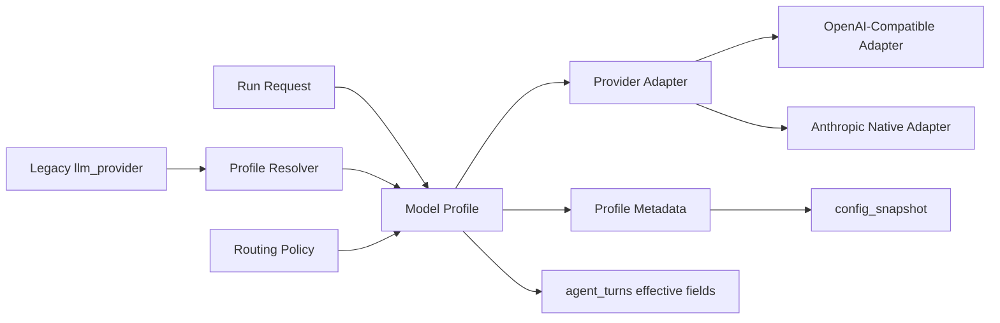

# HANDOFF_SENNA_ARC7 — Model Portability Foundation

**Owner:** GrandMaster → Cursor Architect → Cursor Builder  
**Date:** 2026-05-15  
**Arc:** 7 — Model Portability Foundation  
**Iterations:** `senna-iter-30` through `senna-iter-34`  
**Goal:** Make Senna easy to switch between local LM Studio / open-source models and commercial API models without breaking existing runs, exports, or research reproducibility.

---

## State Entering Arc 7

Arc 6 closed with bounded prompt context, round summaries, and durable Markdown transcripts. The current LLM layer already supports:

- `lmstudio` through an OpenAI-compatible `/chat/completions` client.
- `anthropic` through the native Anthropic Messages API.
- `hybrid`, currently hardcoded as Anthropic on the first turn of each round and LM Studio for the rest.
- Per-turn `effective_provider`, `effective_model`, token usage, and run economics.

The main architectural limitation is that model choice is still expressed as a small provider enum. Arc 7 introduces a profile-driven model layer while keeping the old request shape working.

---

## Non-Negotiables

- Preserve `llm_provider=lmstudio`, `llm_provider=anthropic`, and `llm_provider=hybrid` for existing API clients.
- Preserve current default behavior: local LM Studio remains the default when no model selection is provided.
- Keep export and transcript provenance intact: `effective_provider`, `effective_model`, tokens, costs, and `config_snapshot` must remain useful for thesis audit.
- Do not build a full model-management UI in this arc. The frontend gets a simple profile selector only.
- Do not add new commercial providers beyond the generic OpenAI-compatible shape in Arc 7. Provider expansion belongs to Arc 8.

---

## Target Architecture



---

## senna-iter-30 — Generic OpenAI-Compatible Provider

### Goal

Rename the local-only mental model. The existing LM Studio client is already OpenAI-compatible, so make that abstraction explicit while keeping `lmstudio` as a compatibility alias.

### Scope

#### Backend

- Add a generic OpenAI-compatible adapter module, preferably:
  - `backend/src/mirofish_backend/llm/openai_compatible_client.py`
- Move or wrap the current logic from:
  - `backend/src/mirofish_backend/llm/lmstudio_client.py`
- Keep `lmstudio_client.py` as a thin compatibility wrapper if that creates the smallest diff.
- Update `backend/src/mirofish_backend/llm/router.py` so the local path calls the generic adapter.
- Keep `LLM_PROVIDER_VALUES` unchanged for this iteration: `lmstudio`, `anthropic`, `hybrid`.

### Definition of Done

- Existing tests pass.
- New tests prove:
  - `llm_provider=lmstudio` still resolves to the OpenAI-compatible adapter.
  - Existing LM Studio error formatting still returns useful server messages.
  - Token usage parsing still supports `prompt_tokens` / `completion_tokens` and `input_tokens` / `output_tokens`.
- No frontend changes.

### Out of Scope

- Model profiles.
- New provider names in public API.
- New commercial API presets.

---

## senna-iter-31 — Model Profiles

### Goal

Introduce a profile layer so runs can choose a model profile instead of hardcoding provider details.

### Scope

#### Backend

Add a small profile module, for example:

- `backend/src/mirofish_backend/llm/model_profiles.py`

Suggested model:

```python
from dataclasses import dataclass
from typing import Literal

ProviderType = Literal["openai_compatible", "anthropic"]

@dataclass(frozen=True)
class ModelProfile:
    profile_id: str
    label: str
    provider_type: ProviderType
    base_url: str | None
    model_id: str
    api_key_env: str | None
    context_window: int | None
    supports_embeddings: bool
    supports_usage: bool
    pricing_key: str
```

Required built-in profiles:

- `local_lmstudio_default`
- `anthropic_default`

Required resolver behavior:

- No explicit model profile → `local_lmstudio_default`.
- Legacy `llm_provider=lmstudio` → `local_lmstudio_default`.
- Legacy `llm_provider=anthropic` → `anthropic_default`.
- Legacy `llm_provider=hybrid` → routing policy remains `hybrid_first_turn`; model profiles are resolved per turn in `senna-iter-33`.

#### API

- Add optional `model_profile_id` to `SimulationRunRequest`.
- Persist selected profile metadata in `config_snapshot`.
- Keep legacy `llm_provider` in request and snapshot for backward compatibility.

### Definition of Done

- Existing run API behavior remains unchanged when `model_profile_id` is omitted.
- New tests cover profile resolution for no profile, `lmstudio`, `anthropic`, and invalid profile IDs.
- `config_snapshot` records enough profile metadata for reproducibility: profile id, provider type, model id, base URL label or origin, context window, usage support, pricing key.

### Out of Scope

- Frontend selector.
- Data-driven hybrid routing.
- External editable model profile files.

---

## senna-iter-32 — Capabilities + Simple Frontend Profile Selection

### Goal

Expose model profiles to agents and the UI, then replace hardcoded frontend LLM labels with capability-driven choices.

### Scope

#### Backend

- Extend `backend/src/mirofish_backend/api/capabilities.py` with a `model_profiles` block.
- Include:
  - `profile_id`
  - `label`
  - `provider_type`
  - `model_id`
  - `is_default`
  - short user-facing description
  - whether usage and embeddings are supported

#### Frontend

- Update `frontend/src/lib/api.ts` with profile/capability types.
- Update `frontend/src/App.tsx` run setup to choose from profile data.
- Keep labels simple:
  - Local model
  - Claude
  - Mixed local + Claude, if still exposed through legacy `hybrid`
- If capabilities fetch fails, fall back to the existing hardcoded choices.

### Definition of Done

- Existing UI still allows local, Claude, and mixed routing.
- `POST /simulations/run` sends `model_profile_id` when a concrete profile is selected.
- Legacy `llm_provider` fallback still works.
- Frontend build passes.
- Backend tests pass.

### Out of Scope

- A profile editor.
- Secrets management UI.
- Adding OpenAI/OpenRouter presets.

---

## senna-iter-33 — Data-Driven Routing Policies

### Goal

Move hybrid behavior out of hardcoded turn-index logic and into named routing policies.

### Scope

#### Backend

Add a routing policy layer, either in `router.py` or a new module:

- `local_only`
- `frontier_only`
- `hybrid_first_turn`

Required behavior:

- `llm_provider=lmstudio` maps to `local_only`.
- `llm_provider=anthropic` maps to `frontier_only`.
- `llm_provider=hybrid` maps to `hybrid_first_turn`.
- `hybrid_first_turn` preserves current behavior exactly: frontier profile on `turn_index == 1`, local profile otherwise.

Persist:

- `routing_policy`
- resolved local profile id
- resolved frontier profile id
- per-turn effective profile id, provider, and model where practical

### Definition of Done

- Existing hybrid tests still pass.
- New tests prove `hybrid_first_turn` matches the old behavior.
- `config_snapshot` makes the routing policy auditable.
- Transcript/export still contain `effective_provider` and `effective_model`.

### Out of Scope

- More complex routing policies.
- Planner choosing routing policies automatically.
- Analysis endpoint rerouting.

---

## senna-iter-34 — Arc 7 Hardening + Migration Checks

### Goal

Make the transition safe enough for Arc 8 provider expansion.

### Scope

#### Compatibility

- Test old request shapes:
  - omitted `llm_provider`
  - `llm_provider=lmstudio`
  - `llm_provider=anthropic`
  - `llm_provider=hybrid`
- Test new request shape:
  - `model_profile_id=local_lmstudio_default`
  - `model_profile_id=anthropic_default`

#### Exports and Economics

- Confirm export JSON and ZIP still report:
  - `effective_provider`
  - `effective_model`
  - input/output tokens where available
  - run economics
  - `config_snapshot` profile/routing metadata

#### Documentation

- Update only the docs required by this arc:
  - closeout for `senna-iter-34`
  - `SESSION_STATE.md`
  - `HANDOFF_TO_ARCHITECT.md` sign-off table
- Do not update Arc 8 specs yet unless GrandMaster has issued `HANDOFF_SENNA_ARC8.md`.

### Definition of Done

- Backend tests pass.
- Frontend build passes.
- A short local run works with the default LM Studio profile.
- Hybrid compatibility is verified by tests or a mocked run.
- Architect can mark Arc 7 complete and hand back to GrandMaster for arc review.

---

## Arc 7 Definition of Complete

Arc 7 is complete when:

1. All five gates, `senna-iter-30` through `senna-iter-34`, have Architect verdict **PASS** or **PASS_WITH_ISSUES** with follow-ups applied.
2. Existing API clients can still use `llm_provider`.
3. New clients can use `model_profile_id`.
4. `GET /capabilities` exposes model profile metadata.
5. The frontend uses capabilities for model/profile choices with a fallback path.
6. Hybrid routing remains behaviorally equivalent to the current implementation.
7. Exports and transcripts retain model provenance for thesis audit.

---

## Arc 8 Preview — Model Ecosystem and Guardrails

Arc 8 should not start until Arc 7 has passed GM review. Expected themes:

- Model capability registry: context window, JSON/state reliability, reasoning leakage risk, usage support, embedding support, and recommended concurrency.
- Commercial OpenAI-compatible profiles: OpenAI, OpenRouter, Together/Groq-style providers where the same adapter works.
- Pre-run context and cost checks using the existing economics path.
- Structured-output hardening for local models that omit or mangle `<state>` blocks.
- End-to-end validation across LM Studio local, Anthropic, OpenAI-compatible mock, and hybrid.

GrandMaster should issue a separate `HANDOFF_SENNA_ARC8.md` after Arc 7 lands, because Arc 8 details should reflect what the profile layer actually looks like in code.

---

## Handoff to Cursor Architect

Architect should seed Builder one iteration at a time from this file. Do not paste the whole arc into Builder chat. Point Builder to the active section and the previous closeout. Builder must not implement future iterations early.
