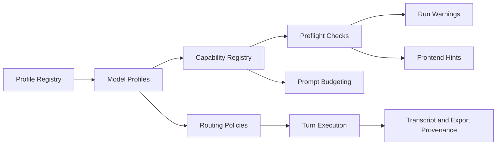

# HANDOFF_SENNA_ARC8 — Model Ecosystem and Guardrails

**Owner:** GrandMaster → Cursor Architect → Cursor Builder  
**Date:** 2026-05-19  
**Arc:** 8 — Model Ecosystem and Guardrails  
**Iterations:** `senna-iter-35` through `senna-iter-39`  
**Goal:** Make the Arc 7 model-profile layer robust enough for open-source local models, OpenAI-compatible commercial APIs, and thesis-grade run planning without compromising reproducibility.

---

## State Entering Arc 8

Arc 7 closed with GM **PASS** after a post-review fix. The platform now has:

- A generic OpenAI-compatible chat adapter with `lmstudio_client.py` retained as a compatibility shim.
- Built-in model profiles: `local_lmstudio_default` and `anthropic_default`.
- `model_profile_id` on `POST /simulations/run`, with profile-only inference fixed (`anthropic_default` alone routes to `anthropic`).
- `/capabilities.model_profiles` and a simple frontend selector.
- Named routing policies: `local_only`, `frontier_only`, `hybrid_first_turn`.
- Per-turn `effective_profile_id` for LLM turns, plus export/economics hardening.

Arc 8 extends this foundation. It should not rework the simulation model, add a full model-management UI, or introduce user-supplied arbitrary profile files yet.

---

## Carry-Forward From Arc 7 Reviews

These are not blockers for Arc 7, but they should be absorbed into Arc 8:

- Agent planner path lacks `model_profile_id`.
- Arc 7 hardening tests may emit async mock resource warnings around patched `asyncio.create_task`.
- Tier-3 heuristic turns currently have `effective_provider="heuristic"` / `effective_model="none"` but no explicit `effective_profile_id` policy.
- `BUILTIN_PROFILE_IDS` is a literal frozenset; commercial profiles need a registry pattern.
- Live LM Studio smoke is still manual / mocked in CI.

---

## Non-Negotiables

- Preserve all Arc 7 request shapes and compatibility behavior.
- Keep `llm_provider` usable for legacy clients.
- Keep `model_profile_id` authoritative for profile-aware clients.
- Do not require API keys for local-only tests.
- Do not leak secrets into `config_snapshot`, exports, logs, or frontend capabilities.
- Keep provider expansion profile-driven; avoid adding provider-specific UI sprawl.
- Any paid/commercial provider path must be mock-testable without network access.

---

## Target Architecture



---

## senna-iter-35 — Planner Parity + Arc 7 Cleanup

### Goal

Close the accepted Arc 7 follow-ups that should be fixed before adding more provider profiles.

### Scope

#### Agent planner parity

- Add optional `model_profile_id` to the agent planning path:
  - `backend/src/mirofish_backend/agent/orchestrator.py`
  - any `PlanSimulationParams` / execution-plan validation helpers
  - request construction that eventually builds `SimulationRunRequest`
- The planner should treat `model_profile_id` as an optional run parameter, not as a required planning field.
- Preserve existing `llm_provider` planner behavior.

#### Test cleanup

- Clean Arc 7 hardening test warnings caused by patched async scheduling.
- Prefer a tiny synchronous stand-in or a properly handled `AsyncMock` / awaitable pattern, whichever fits the existing tests with least churn.

#### Tier-3 provenance policy

- Decide and implement explicit `effective_profile_id` behavior for Tier-3 heuristic rows.
- Recommended policy:
  - `effective_provider="heuristic"`
  - `effective_model="none"`
  - `effective_profile_id="heuristic"`
- Document this as a sentinel, not a model profile.
- Ensure export consumers do not see `null` for Tier-3 provenance.

### Definition of Done

- Backend tests pass.
- New tests show agent plans can carry `model_profile_id` into queued simulation requests.
- Existing planner tests still pass when `model_profile_id` is absent.
- Arc 7 hardening tests run without async mock resource warnings.
- Tier-3 rows persist/export `effective_profile_id="heuristic"` or an explicitly documented equivalent sentinel.

### Out of Scope

- New commercial profiles.
- Capability-based prompt budgeting.
- Frontend changes unless required for a type update.

---

## senna-iter-36 — Profile Registry + Model Capability Registry

### Goal

Replace literal built-in profile enumeration with a registry pattern, then add explicit model capabilities that later iterations can use for preflight and prompt safety.

### Scope

#### Profile registry

- Refactor `backend/src/mirofish_backend/llm/model_profiles.py` so built-ins are described through a registry-like structure.
- Keep public profile ids stable:
  - `local_lmstudio_default`
  - `anthropic_default`
- Keep `BUILTIN_PROFILE_IDS` available if tests/imports still need it, but derive it from the registry.
- Add an `is_builtin` concept in capability snapshots if useful for future user profiles.

#### Capabilities

Add explicit capability metadata per profile. Suggested fields:

```python
context_window: int | None
supports_embeddings: bool
supports_usage: bool
supports_streaming: bool
json_reliability: str  # high | medium | low
state_block_reliability: str  # high | medium | low
reasoning_leakage_risk: str  # low | medium | high
recommended_max_concurrency: int
```

These fields may live on `ModelProfile` directly or in a nested `ModelCapabilities` dataclass. Prefer the smallest structure that keeps `profile_snapshot_dict` and `/capabilities` readable.

### Definition of Done

- Existing Arc 7 profile tests pass.
- Registry-derived IDs match the previous built-in IDs.
- `/capabilities.model_profiles.profiles[]` includes capability metadata without exposing secrets.
- `config_snapshot` keeps enough capability metadata for reproducibility.
- Tests cover at least one local profile and one frontier profile capability row.

### Out of Scope

- New providers.
- Enforcing context budgets.
- User-editable profiles.

---

## senna-iter-37 — Commercial OpenAI-Compatible Profiles

### Goal

Add commercial OpenAI-compatible profile presets while continuing to route through the generic adapter.

### Scope

#### Profiles

Add built-in profile presets for:

- `openai_default`
- `openrouter_default`

Optional stretch only if the code shape is already clean:

- `groq_default`
- `together_default`

Each profile should include:

- `provider_type="openai_compatible"`
- base URL from settings/env
- model id from settings/env
- API key env name
- pricing key
- capability metadata

#### Adapter authentication

- Extend the OpenAI-compatible adapter to support optional bearer token auth through a resolved API key.
- Do not store API key values in `config_snapshot`, logs, or frontend capabilities.
- Local LM Studio must continue to work without auth headers.

#### Settings

- Add conservative settings fields for base URLs / model ids / API key env names.
- Defaults should not require accounts or network access.

### Definition of Done

- Backend tests pass without real network/API keys.
- Tests prove OpenAI-compatible commercial profiles resolve into base URL, model id, provider type, and API key env metadata.
- Tests prove the adapter adds an Authorization header when an API key is provided and omits it for local LM Studio.
- `GET /capabilities` exposes commercial profile rows without secret values.
- Existing local, Anthropic, and hybrid paths remain green.

### Out of Scope

- Native OpenAI Responses API.
- Native Gemini adapter.
- Full provider management UI.
- Actual live commercial API calls in CI.

---

## senna-iter-38 — Pre-Run Context and Cost Checks

### Goal

Add a preflight estimator that warns analysts before launching runs that may exceed context, latency, or cost expectations.

### Scope

#### Backend preflight

Create a pure preflight module, likely:

- `backend/src/mirofish_backend/simulation/preflight.py`

It should estimate:

- total planned speaking turns
- approximate LLM turns by profile/provider
- heuristic/Tier-3 turns
- rough context pressure from round count, `agent_limit`, `speakers_per_round`, `round_summary_enabled`, and model context window
- estimated paid cost envelope using existing economics pricing functions
- warnings for missing token usage support, unknown context window, or likely context pressure

#### API integration

- Add warnings to `POST /simulations/run` response using the existing `warnings[]` field.
- Include preflight metadata in `config_snapshot`, but keep it compact.
- Add preflight info to `/capabilities` only if needed for frontend rendering.

#### Frontend

- Surface preflight warnings in the Run setup flow using existing warning UI patterns.
- Do not block runs unless there is already a hard validation failure.

### Definition of Done

- Backend tests cover pure preflight functions and API warning propagation.
- Frontend build passes.
- Existing warnings (roster/population/network) still appear alongside preflight warnings.
- Local-only runs remain estimated as `$0`.
- Hybrid/frontier/commercial profiles produce non-zero cost envelopes when pricing is known.

### Out of Scope

- Exact tokenizer integration.
- Hard spend caps.
- Invoice reconciliation.

---

## senna-iter-39 — Structured Output Reliability + Arc 8 Integration

### Goal

Make local-model state extraction failures auditable, then run an integration sweep across the expanded model ecosystem.

### Scope

#### Structured-output reliability

- Harden state extraction for models that omit, mangle, or duplicate `<state>` blocks.
- Add provenance fields where useful so exports can distinguish:
  - model-provided state
  - repaired state
  - fallback/heuristic state
- Keep deterministic fallback behavior; do not introduce an extra LLM repair call in this arc unless Architect explicitly approves it as a tiny opt-in.

#### Manual smoke support

- Add an optional manual smoke script or manual pytest marker for live LM Studio profile testing.
- Pattern should match the existing manual SSE placeholder style.
- It must not run in the default test suite.

#### Integration validation

Validate:

- local LM Studio profile path
- Anthropic native profile path
- OpenAI-compatible commercial profile path via mock
- hybrid routing
- Tier-3 heuristic provenance
- export JSON/ZIP provenance
- preflight warnings
- frontend build

### Definition of Done

- Backend tests pass.
- Frontend build passes.
- New malformed-output tests cover missing/invalid `<state>` behavior and provenance.
- Arc 8 integration tests cover local, Anthropic, OpenAI-compatible mock, and hybrid paths without network.
- Manual LM Studio smoke instructions or script exists but is skipped by default.
- Architect can mark Arc 8 complete and return to GrandMaster for arc review.

### Out of Scope

- Full JSON schema constrained decoding across providers.
- User profile management UI.
- RAG over transcript content.

---

## Arc 8 Definition of Complete

Arc 8 is complete when:

1. All five gates, `senna-iter-35` through `senna-iter-39`, have Architect verdict **PASS** or **PASS_WITH_ISSUES** with follow-ups applied.
2. Agent planner paths can pass `model_profile_id` where run API paths can.
3. Profile ids are registry-derived, not maintained as independent literal lists.
4. Model capabilities are exposed through `/capabilities` and captured in run provenance.
5. Commercial OpenAI-compatible profiles can be selected and tested without live network calls.
6. Pre-run context/cost warnings are available in API and visible in the Run setup UI.
7. Structured-output failures are auditable in exports, especially for local/open-source models.
8. Tier-3 heuristic turns have explicit, non-null provenance.

---

## Handoff to Cursor Architect

Architect should seed Builder one iteration at a time from this file. Do not paste the whole arc into Builder chat. Point Builder to the active section and the previous closeout. Builder must not implement future iterations early.
